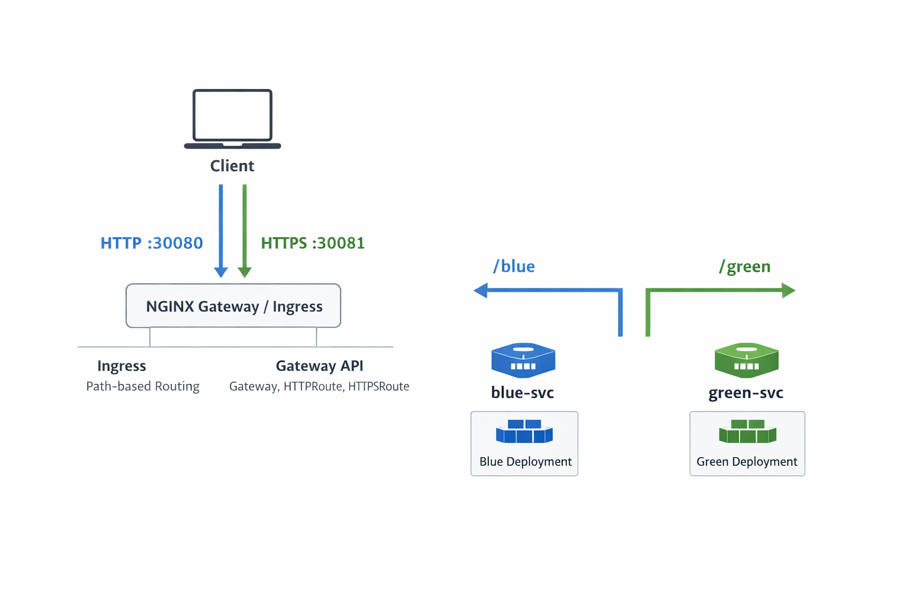

# Kubernetes Ingress vs Gateway API  
## Blue/Green Traffic Routing with NGINX Controllers

This repository demonstrates **production-aligned HTTP/HTTPS traffic routing in Kubernetes** using two approaches:

- **NGINX Ingress Controller (Ingress API)**
- **NGINX Gateway Fabric (Kubernetes Gateway API)**

The goal is to compare **Ingress and Gateway API side-by-side** using a **Blue/Green deployment model**, TLS termination, and real request validation via `curl`.

> **This is not theory.** Every manifest in this repository is runnable and verifiable.

---

## Why This Project Exists

Ingress is widely used but increasingly **limited**:

- HTTP/HTTPS only
- Heavy reliance on annotations
- Poor separation of infrastructure vs application ownership

Gateway API is the **evolution path**:

- Multi-protocol support (L4–L7)
- Clear role separation (`GatewayClass` / `Gateway` / `Routes`)
- Safer multi-team delegation
- Native traffic shaping

This repository answers one question:

> **“Why would I move from Ingress to Gateway API in real clusters?”**

---

## Architecture Overview


TLS is terminated at the **Ingress Controller / Gateway**, not at application pods.

---
## Repository Structure
```bash 
.
├── ingress/
│   ├── namespace.yaml
│   ├── blue-deployment.yaml
│   ├── green-deployment.yaml
│   ├── tls-secret.yaml
│   └── web-ingress.yaml
│
├── gateway-api/
|   ├── namespace.yaml
│   ├── blue-deployment.yaml
│   ├── green-deployment.yaml
│   ├── tls-secret.yaml
│   ├── gatewayclass.yaml
│   ├── gateway.yaml
│   ├── httproute-http.yaml
│   ├── httproute-https.yaml
│   └── referencegrant.yaml
│
├── diagrams/
│   └── gateway-ingress.png
│
└── README.md

```
---
## Part 1: Ingress Implementation (NGINX Ingress Controller)

### What Is Demonstrated

- HTTP and HTTPS traffic routing
- Path-based routing using `/blue` and `/green`
- TLS termination using Kubernetes Secrets
- Blue/Green deployment separation at the service level
---
### Traffic Flow
```bash 
Client → NodePort / LoadBalancer
      → NGINX Ingress Controller
      → Service
      → Pod
```
```text
Ingress resources are declarative only.
The controller enforces traffic behavior.
```
---
### Key Notes

- Ingress resources are **purely declarative**
- The **NGINX Ingress Controller** is responsible for enforcing all traffic behavior
- TLS is terminated at the Ingress controller using the configured Kubernetes Secret
- Routing decisions are made based on request paths and defined backend services
---

### Part 2: Gateway API Implementation (NGINX Gateway Fabric)
#### What is demonstrated

- GatewayClass, Gateway, HTTPRoute separation
- Multiple listeners (HTTP + HTTPS)
- TLS termination at Gateway
- Cross-namespace TLS access using ReferenceGrant
- Clean Blue/Green routing without annotations

---
### Role Separation (This Matters in Real Teams)

| Role           | Resource     | Responsibility                         |
|----------------|--------------|----------------------------------------|
| Infra Provider | GatewayClass | Controller selection                   |
| Platform Team  | Gateway      | Entry points, TLS, listeners           |
| App Team       | HTTPRoute    | Application-level routing rules        |

#### **This is the core advantage of Gateway API over Ingress.**  
---
```text
Ingress collapses these responsibilities into a single resource, which does not scale in real-world, multi-team environments.
```
---
